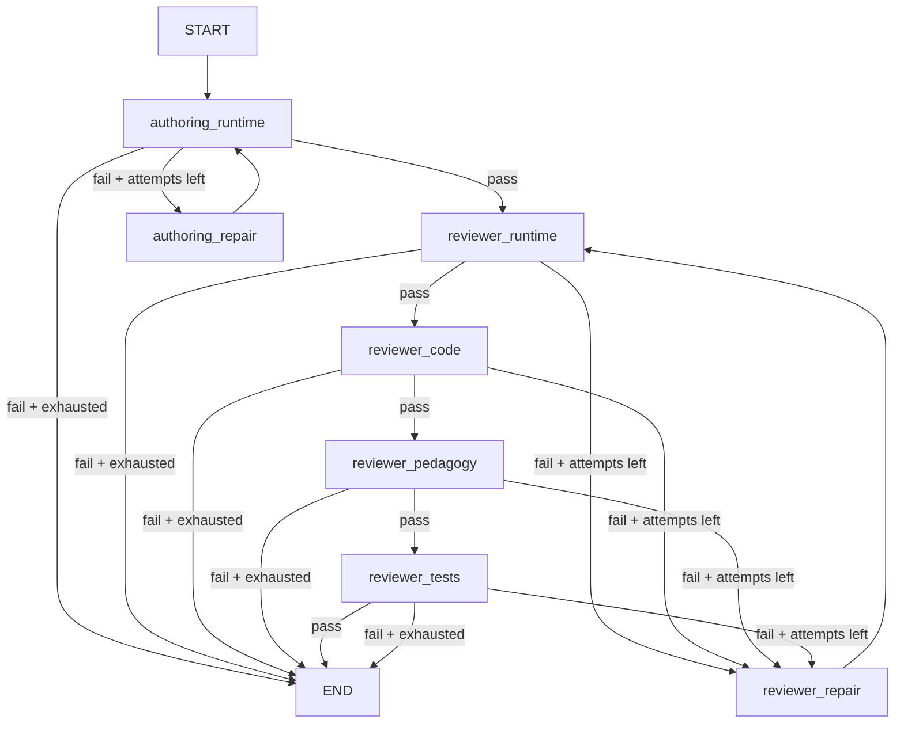

# Course Gen Codex

Course Gen Codex is a creator-to-learner pipeline for turning a high-level engineering brief into a learner-ready course project with:

- a creator-facing planning flow
- a deliverable-first course draft model
- a LangGraph-based author/review loop for assignment generation
- publish-time learner-path certification
- a shared learner workspace and assignment-wide grading
- draft timeline visibility across course events, workflow events, and reviewer nodes

The current system is intentionally opinionated around one core promise:

> the learner should receive one real project, in one real workspace, with review grouped by visible deliverables, and the exact learner path should be tested before publish.

## Current status

This repo is in active refactor mode. The current backbone is:

- **deliverables**, not modules
- **project contracts + runtime plans**, not static language-specific templates as the product surface
- **creator-specified stack constraints**, with authoring responsible for specializing the generated assignment under those constraints
- **SQLite through the store layer** for local persistence today
- **Docker-backed runtime execution and learner certification**

Important note on persistence:

- The app does **not** read draft state directly from Postgres today.
- All draft/course/workflow/timeline views go through the current store and service layer, which is backed by [`app/storage/sqlite_store.py`](app/storage/sqlite_store.py).
- If the store is swapped later, the API and UI should continue to work without changing callers.

## Product surfaces

### Creator side

- `/create-course`
  - brief entry
  - suggested outcomes and stack defaults
  - creator-chosen runtime constraints
  - draft review
  - publish controls
- `/draft-timeline?draft=<course_run_id>`
  - merged timeline view for one draft

### Learner side

- `/`
  - LMS home
- `/courses`
  - course catalog
- learner enrollment view
  - project brief
  - deliverable scorecards
  - workspace launch
  - assignment submission and review guidance

## Architecture at a glance

```mermaid
flowchart LR
    A["Creator brief + setup choices"] --> B["CourseGenerationService"]
    B --> C["CourseWorkflowService"]
    C --> D["WorkflowService"]
    D --> E["LangGraphAssignmentGraph"]
    E --> F["PublishSnapshotService"]
    F --> G["PublishLearnerCertificationService"]
    G --> H["Published course"]
    H --> I["LMSService"]
    I --> J["LearnerStudioService"]
    J --> K["Assignment grading + learner feedback"]
```



## Repository layout

The repo is organized around a few stable layers:

- `app/domain/`
  - typed contracts for creator, workflow, publish, learner, grading, and registry models
- `app/services/`
  - orchestration, authoring, reviewer logic, publish packaging, learner runtime, and page builders
- `app/api/`
  - FastAPI routes that expose the creator, workflow, grading, and LMS contracts
- `app/templates/` + `app/static/`
  - creator, learner, and draft-timeline UI surfaces
- `app/storage/`
  - the current store implementation (`SQLiteWorkflowStore`)
- `docker/`
  - shared runtime images, including learner studio
- `tests/`
  - focused architectural regression slices for the current refactor path
- `scripts/`
  - smoke flows and local utility scripts

This is useful to keep in mind when you trace behavior:

- if the question is **"what data exists?"**, start in `app/domain/`
- if the question is **"who orchestrates this?"**, start in `app/services/`
- if the question is **"what does the UI call?"**, start in `app/api/routes.py`
- if the question is **"where is state stored?"**, start in `app/storage/sqlite_store.py`

## Core concepts

### `CourseRun`

Defined in [`app/domain/course.py`](app/domain/course.py).

This is the creator-facing draft or published course record. It owns:

- title and summary
- creator goal and requested learning outcomes
- visible deliverables
- the linked shared workflow run
- publish snapshot linkage
- creator-facing stage and status

Think of `CourseRun` as the product-level object.

### `WorkflowRun`

Defined in [`app/domain/workflow.py`](app/domain/workflow.py).

This is the assignment-generation object that moves through the author/reviewer loop. It owns:

- generation intake
- authored assignment spec
- node executions
- review summary
- workspace and bundle artifacts

Think of `WorkflowRun` as the assignment compiler job.

### `PublishSnapshot`

Defined in [`app/domain/publish.py`](app/domain/publish.py).

This is the frozen learner-facing artifact. It is what certification and LMS rely on.

### `LearnerEnrollment`

Defined in [`app/domain/learner.py`](app/domain/learner.py).

This binds one learner to one published snapshot and one shared workspace.

### `TaskAgentServiceSpec`

Defined in [`app/domain/task_agent.py`](app/domain/task_agent.py).

This is still the main generated assignment spec. It currently contains:

- project contract
- runtime dependencies
- capabilities
- assessment strategy
- deliverables
- tool registry
- eval dataset
- production contract
- learner starter surface

## The service map

### `CourseGenerationService`

File: [`app/services/course_generation_service.py`](app/services/course_generation_service.py)

Responsibility:

- creator-plan generation
- suggested outcomes
- creator setup normalization
- brief-to-course orchestration

This is the creator-intake entry point.

### `CourseWorkflowService`

File: [`app/services/course_workflow_service.py`](app/services/course_workflow_service.py)

Responsibility:

- create and refresh `CourseRun`
- align course deliverables to the linked workflow run
- publish orchestration
- creator review diagnostics
- timeline aggregation

This is the course-level orchestrator.

### `WorkflowService`

File: [`app/services/workflow_service.py`](app/services/workflow_service.py)

Responsibility:

- create and mutate `WorkflowRun`
- execute LangGraph nodes
- apply HIL decisions
- materialize bundles
- persist workflow events

This is the workflow-level control plane.

### `LangGraphAssignmentGraph`

File: [`app/services/langgraph_assignment_graph.py`](app/services/langgraph_assignment_graph.py)

Responsibility:

- author/review loop
- repair routing
- reviewer findings
- sandbox-backed verification

This is the LangGraph execution graph behind assignment generation.

### `PublishSnapshotService`

File: [`app/services/publish_snapshot_service.py`](app/services/publish_snapshot_service.py)

Responsibility:

- freeze the learner package
- build the learner-facing course/project package
- produce deliverable docs and starter files

### `PublishLearnerCertificationService`

File: [`app/services/publish_learner_certification_service.py`](app/services/publish_learner_certification_service.py)

Responsibility:

- certify the exact learner path before publish
- seed the publish snapshot into a learner runtime path
- run the same grading/runtime path the learner will actually hit
- block publish when certification fails

This is intentionally outside the core LangGraph node list today, but it acts like a final publish blocker.

### `LMSService`

File: [`app/services/lms_service.py`](app/services/lms_service.py)

Responsibility:

- published course catalog
- enrollment creation
- shared workspace seeding
- learner submission handling
- learner-facing report shaping

### `LearnerStudioService`

File: [`app/services/learner_studio_service.py`](app/services/learner_studio_service.py)

Responsibility:

- launch the learner editor/runtime
- boot the runtime plan
- run assignment grading against the learner workspace

### `OpenAITaskAgentAuthoringService`

File: [`app/services/openai_task_agent_authoring.py`](app/services/openai_task_agent_authoring.py)

Responsibility:

- specialize the generic assignment base with:
  - task schema
  - output schema
  - eval cases
  - starter surface guidance

This is where the assignment becomes domain-specific without hardcoding domain compilers as the long-term strategy.

## End-to-end flow

### 1. Creator brief

The creator provides:

- problem statement
- desired outcomes
- optional language/framework/runtime constraints
- optional data sources

If the creator leaves stack fields blank, the system suggests defaults. If the creator pins them, authoring is expected to respect them.

### 2. Design inference

[`app/services/assignment_design_inference.py`](app/services/assignment_design_inference.py) turns the brief into a design spec that includes:

- project family hints
- runtime dependency shape
- database/cache hints
- runtime plan metadata
- capabilities and assessment shape

### 3. Course draft creation

`CourseGenerationService` converts the creator plan into a `CourseRun`.

For progressive codebase courses, that `CourseRun` links to one shared `WorkflowRun`.

### 4. Workflow authoring and review

The `WorkflowService` creates the workflow run and pushes it through `LangGraphAssignmentGraph`.

At this point the system is building and validating the shared assignment spec, not publishing it yet.

### 5. Publish snapshot

When the course reaches publish readiness, `PublishSnapshotService` freezes the learner package.

### 6. Learner-path certification

Before publish is allowed to complete, `PublishLearnerCertificationService` runs the exact learner-path certification:

- seed workspace
- boot runtime
- run grading path
- verify learner-facing mapping

### 7. LMS and learner workflow

Once published, `LMSService` and `LearnerStudioService` drive:

- enrollment
- workspace launch
- assignment submission
- deliverable scorecards
- learner review guidance

## Course-layer flow vs workflow-layer flow

One thing that is easy to miss when you first read the codebase: there are **two orchestration layers**.

### Course layer

Owns:

- creator-facing drafts
- deliverable planning
- publish readiness
- publish snapshots
- learner-path certification

Primary entry points:

- `CourseGenerationService`
- `CourseWorkflowService`
- `PublishSnapshotService`
- `PublishLearnerCertificationService`

### Workflow layer

Owns:

- the shared assignment-generation run
- LangGraph node execution
- reviewer findings
- author/repair loops

Primary entry points:

- `WorkflowService`
- `LangGraphAssignmentGraph`

That split is intentional:

- the **workflow layer** compiles and reviews the assignment
- the **course layer** decides whether that compiled assignment is ready for creators and safe for learners

## LangGraph assignment flow

This is the current LangGraph node flow defined in [`app/services/langgraph_assignment_graph.py`](app/services/langgraph_assignment_graph.py).



### What each node does

#### `authoring_runtime`

- authors or syncs the workspace
- runs sandbox verification
- proves the generated assignment compiles/boots at a workflow level

#### `authoring_repair`

- applies repair logic after authoring/runtime failure
- may update workspace and spec

#### `reviewer_runtime`

- validates the runtime/sandbox path

#### `reviewer_code`

- validates starter authenticity
- rejects thin wrappers and fake learner-owned files

#### `reviewer_pedagogy`

- checks learner clarity
- checks that the starter surface, docs, and scenarios make sense to a learner

#### `reviewer_tests`

- validates the hidden/public check relationship
- validates deliverable coverage
- validates learner starter surface coverage

### Important nuance

The publish-time learner certification step is **not** one of these LangGraph nodes today. It is a course-layer publish blocker because it needs the final publish snapshot and the exact learner runtime path.

That is one of the most important architecture choices in the repo right now. We do not want to certify "something close to what the learner will see"; we want to certify the exact learner path.

## Runtime plans

The system is moving toward a runtime-plan-driven model rather than a hand-maintained language matrix.

Current shape:

- creator chooses or accepts stack defaults
- design inference carries those constraints into the project contract
- starter generation and runtime execution increasingly read from that runtime plan
- the platform still enforces the safe execution envelope

The long-term goal is:

- creator owns stack constraints
- authoring owns generated runtime topology
- platform owns execution and certification

In practice, that means we are trying to avoid two bad extremes:

- a brittle hand-maintained scaffold catalog for every language/framework/domain combination
- a completely unconstrained authoring loop that invents unsafe runtime behavior the platform cannot certify

The current compromise is:

- creator constraints flow into the project contract
- authoring specializes the runtime plan under those constraints
- platform executes the generated plan inside a bounded runtime envelope

## Learner starter surface

One of the recent root fixes is the `learner_starter_surface` model in [`app/domain/task_agent.py`](app/domain/task_agent.py).

That surface is designed to answer:

- what files the learner really owns
- what endpoints or interfaces must remain stable
- what concrete domain scenarios they should think about
- what “done” means for the current deliverable

This exists to prevent a bad pattern we explicitly do **not** want:

- generic simulator wrappers
- hidden logic doing the real work
- learner docs telling someone to “replace the wrapper”

The intended shape is:

> the learner extends a believable starter app in learner-owned files, and the authored guidance explains the real work clearly.

## Draft timeline

The timeline page is built from:

- course events
- workflow events
- workflow node executions

The API:

- `GET /v1/course-runs/{course_run_id}/timeline`

The page:

- `/draft-timeline?draft=<course_run_id>`

This view exists so you can see:

- what happened at the course layer
- what happened inside the workflow layer
- which nodes passed, failed, or retried
- when the draft moved forward, blocked, or got repaired

The timeline intentionally merges data from:

- `CourseEvent`
- `WorkflowEvent`
- `WorkflowNodeExecution`

so you do not need to mentally stitch course state and workflow state together by hand.

## Storage model

Current persistence lives in [`app/storage/sqlite_store.py`](app/storage/sqlite_store.py).

Key persisted records:

- `workflow_runs`
- `workflow_events`
- `course_runs`
- `course_events`
- `publish_snapshots`
- `learner_enrollments`
- `learner_submissions`
- `learner_workspace_sessions`
- creator and learner feedback records

The important architectural choice is:

> callers should go through the store and service layer, not query the database directly.

That keeps UI and API code stable when storage changes.

## Running locally

```bash
python3 -m venv .venv
.venv/bin/python -m pip install -e .
.venv/bin/python -m uvicorn app.main:app --reload
```

Open:

- `http://127.0.0.1:8000/create-course`
- `http://127.0.0.1:8000/draft-timeline`
- `http://127.0.0.1:8000/`
- `http://127.0.0.1:8000/docs`

## OpenAI configuration

Optional environment:

```bash
export COURSE_GEN_OPENAI_ENV_FILE=/absolute/path/to/openai.env.keys
```

The env file can contain:

```bash
OPENAI_API_KEY=...
OPENAI_MODEL=gpt-5.4
```

Useful status endpoints:

- `GET /v1/course-generation/status`
- `GET /v1/task-agent-authoring/status`
- `GET /v1/sandbox/status`

## Useful endpoints

### Course and creator flow

- `GET /v1/course-runs`
- `POST /v1/course-runs`
- `GET /v1/course-runs/{course_run_id}`
- `GET /v1/course-runs/{course_run_id}/events`
- `GET /v1/course-runs/{course_run_id}/timeline`
- `GET /v1/course-runs/{course_run_id}/review`
- `GET /v1/course-runs/{course_run_id}/creator-view`
- `POST /v1/course-runs/{course_run_id}/sync`
- `POST /v1/course-runs/{course_run_id}/materialize`
- `POST /v1/course-runs/{course_run_id}/publish`
- `POST /v1/course-runs/{course_run_id}/create-revision`

### Workflow and assignment generation

- `GET /v1/workflow-runs`
- `POST /v1/workflow-runs`
- `GET /v1/workflow-runs/{run_id}`
- `GET /v1/workflow-runs/{run_id}/events`
- `GET /v1/workflow-runs/{run_id}/nodes`
- `GET /v1/workflow-runs/{run_id}/review`
- `POST /v1/workflow-runs/{run_id}/nodes/execute`

### Learner and LMS

- `GET /v1/lms/catalog`
- `POST /v1/lms/enrollments`
- `GET /v1/lms/enrollments`
- `GET /v1/lms/enrollments/{enrollment_id}/learner-view`
- `POST /v1/lms/enrollments/{enrollment_id}/workspace/launch`
- `POST /v1/lms/enrollments/{enrollment_id}/submit`

## Focused verification

Two focused test slices are useful for the current architecture:

```bash
uv run --with pytest pytest -q tests/test_runtime_plan_runtime_images.py
uv run --with pytest pytest -q tests/test_draft_timeline.py
```

The broader test suite is still being cleaned up as older scaffold-era assumptions are removed, so these focused slices are the most trustworthy quick checks for the current refactor path.

## What is still evolving

- runtime-plan execution for broader multi-service topologies
- authoring ownership of more of the starter/runtime topology
- further cleanup of older scaffold-era assumptions in the broader test suite
- deeper stack/version flexibility without turning the platform into a hand-maintained language matrix

## Guiding principles

The current refactor is organized around a few strong rules:

1. **One real project, not checkpoint mini-projects**
2. **Deliverables, not modules**
3. **Creator chooses constraints**
4. **Authoring specializes the project under those constraints**
5. **Platform certifies the exact learner path before publish**
6. **UI reads through service/store contracts, not direct database queries**

That is the architecture this repo is currently trying to make true, end to end.
