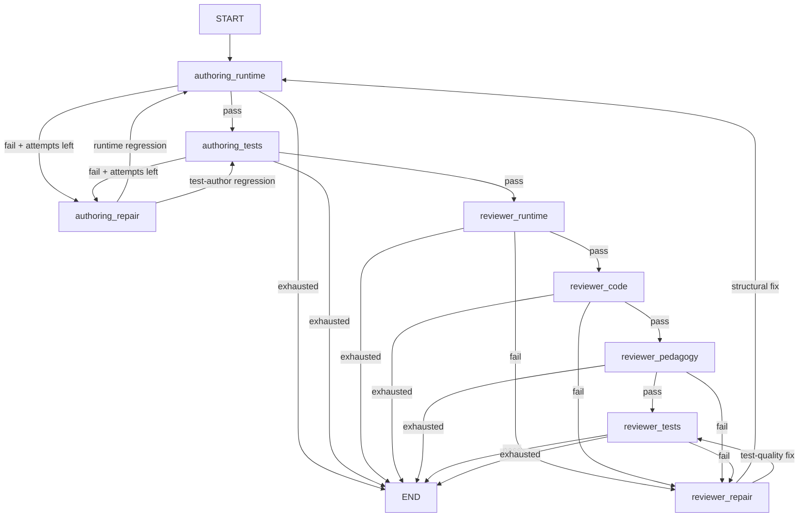

# Course Gen Codex

Course Gen Codex is a creator-to-learner pipeline for turning a high-level engineering brief into a learner-ready course project with:

- a creator-facing planning flow
- a deliverable-first course draft model
- a LangGraph-based author/review loop for assignment generation
- generated visible and hidden test scripts authored against the real starter workspace
- a baseline matrix verifier that proves untouched starters fail and deeper bugs still get caught
- publish-time learner-path certification
- a shared learner workspace and assignment-wide grading
- draft timeline visibility across course events, workflow events, and reviewer nodes

The current system is intentionally opinionated around one core promise:

> the learner should receive one real project, in one real workspace, with review grouped by visible deliverables, and the exact learner path should be tested before publish.

One explicit engineering guardrail for this refactor:

> do not add custom starter/compiler code for individual languages or frameworks.
>
> Keep the repo/runtime contract dumb and creator-owned. Make the harness strong enough to boot, verify, repair, and certify the authored repo instead of teaching the platform one language at a time.
>
> The authored bundle should own `Dockerfile` and `.coursegen/runtime/*.sh`. Default protocol files should fail loudly until authoring replaces them.
>
> Runtime-plan commands are advisory metadata only. The harness should execute authored runtime protocol files, not platform-synthesized language commands.
>
> Do not use string matching, regex, or prose heuristics to decide whether a stack is supported or how it should execute. The creator-owned stack contract, the authored repo/runtime bundle, and harness results are the source of truth.
>
> When a stack needs a dependency lock or toolchain contract, the authored `install.sh` should materialize it deterministically inside the creator-selected base image. The harness may sync only those dependency-contract files back into the starter workspace before runtime boot.
>
> Do not parse raw JSON text from LLM output. Use structured outputs plus a hard-kill timeout boundary so malformed or wedged model calls fail loudly instead of pinning workflow threads.

See [`docs/unseen-stack-dry-run.md`](/Users/tushar/Desktop/codebases/course-gen-codex/docs/unseen-stack-dry-run.md) for the target node-by-node flow when a creator picks an unseen stack.
See [`docs/testing-debug-playbook.md`](/Users/tushar/Desktop/codebases/course-gen-codex/docs/testing-debug-playbook.md) for the practical local loop to test, replay, rerun, stop, and debug failures without drifting back into language-specific fixes.

## Current status

This repo is in active refactor mode. The current backbone is:

- **deliverables**, not modules
- **project contracts + runtime plans**, not static language-specific templates as the product surface
- **creator-specified stack constraints**, with authoring responsible for specializing the generated assignment under those constraints
- **SQLite through the store layer** for local persistence today
- **Docker-backed runtime execution and learner certification**

Important note on persistence:

- The app does **not** read draft state directly from Postgres today.
- All draft/course/workflow/timeline views go through the current store and service layer, which is backed by [`app/storage/sqlite_store.py`](app/storage/sqlite_store.py).
- If the store is swapped later, the API and UI should continue to work without changing callers.

## Product surfaces

### Creator side

- `/create-course`
  - brief entry
  - suggested outcomes and stack defaults
  - creator-chosen runtime constraints
  - draft review
  - publish controls
- `/draft-timeline?draft=<course_run_id>`
  - merged timeline view for one draft

### Learner side

- `/`
  - LMS home
- `/courses`
  - course catalog
- learner enrollment view
  - project brief
  - deliverable scorecards
  - workspace launch
  - assignment submission and review guidance

## Repository layout

The repo is organized around a few stable layers:

- `app/domain/`
  - typed contracts for creator, workflow, publish, learner, grading, and registry models
- `app/services/`
  - orchestration, authoring, reviewer logic, publish packaging, learner runtime, and page builders
- `app/api/`
  - FastAPI routes that expose the creator, workflow, grading, and LMS contracts
- `app/templates/` + `app/static/`
  - creator, learner, and draft-timeline UI surfaces
- `app/storage/`
  - the current store implementation (`SQLiteWorkflowStore`)
- `docker/`
  - shared runtime images, including learner studio
- `tests/`
  - focused architectural regression slices for the current refactor path
- `scripts/`
  - smoke flows and local utility scripts
  - `replay_failure_smoke.py` for replaying the last failed deliverables against the current harness or an optional repo-repair pass without mutating workflow state

This is useful to keep in mind when you trace behavior:

- if the question is **"what data exists?"**, start in `app/domain/`
- if the question is **"who orchestrates this?"**, start in `app/services/`
- if the question is **"what does the UI call?"**, start in `app/api/routes.py`
- if the question is **"where is state stored?"**, start in `app/storage/sqlite_store.py`

## Core concepts

### `CourseRun`

Defined in [`app/domain/course.py`](app/domain/course.py).

This is the creator-facing draft or published course record. It owns:

- title and summary
- creator goal and requested learning outcomes
- visible deliverables
- the linked shared workflow run
- publish snapshot linkage
- creator-facing stage and status

Think of `CourseRun` as the product-level object.

### `WorkflowRun`

Defined in [`app/domain/workflow.py`](app/domain/workflow.py).

This is the assignment-generation object that moves through the author/reviewer loop. It owns:

- generation intake
- authored assignment spec
- node executions
- review summary
- workspace and bundle artifacts

Think of `WorkflowRun` as the assignment compiler job.

### `PublishSnapshot`

Defined in [`app/domain/publish.py`](app/domain/publish.py).

This is the frozen learner-facing artifact. It is what certification and LMS rely on.

### `LearnerEnrollment`

Defined in [`app/domain/learner.py`](app/domain/learner.py).

This binds one learner to one published snapshot and one shared workspace.

### `TaskAgentServiceSpec`

Defined in [`app/domain/task_agent.py`](app/domain/task_agent.py).

This is still the main generated assignment spec. It currently contains the execution and learner-facing surface that authoring/review work against:

- project contract
- runtime dependencies
- capabilities
- assessment strategy
- deliverables
- public endpoints
- learner starter surface
- generated test script metadata

## The service map

### `CourseGenerationService`

File: [`app/services/course_generation_service.py`](app/services/course_generation_service.py)

Responsibility:

- creator-plan generation
- suggested outcomes
- creator setup normalization
- brief-to-course orchestration

This is the creator-intake entry point.

### `CourseWorkflowService`

File: [`app/services/course_workflow_service.py`](app/services/course_workflow_service.py)

Responsibility:

- create and refresh `CourseRun`
- align course deliverables to the linked workflow run
- publish orchestration
- creator review diagnostics
- timeline aggregation

This is the course-level orchestrator.

### `WorkflowService`

File: [`app/services/workflow_service.py`](app/services/workflow_service.py)

Responsibility:

- create and mutate `WorkflowRun`
- execute LangGraph nodes
- apply HIL decisions
- materialize bundles
- persist workflow events

This is the workflow-level control plane.

### `LangGraphAssignmentGraph`

File: [`app/services/langgraph_assignment_graph.py`](app/services/langgraph_assignment_graph.py)

Responsibility:

- author/review loop
- repair routing
- reviewer findings
- sandbox-backed verification

This is the LangGraph execution graph behind assignment generation.

### `PublishSnapshotService`

File: [`app/services/publish_snapshot_service.py`](app/services/publish_snapshot_service.py)

Responsibility:

- freeze the learner package
- build the learner-facing course/project package
- produce deliverable docs and starter files

### `PublishLearnerCertificationService`

File: [`app/services/publish_learner_certification_service.py`](app/services/publish_learner_certification_service.py)

Responsibility:

- certify the exact learner path before publish
- seed the publish snapshot into a learner runtime path
- run the same grading/runtime path the learner will actually hit
- block publish when certification fails

This is intentionally outside the core LangGraph node list today, but it acts like a final publish blocker.

### `LMSService`

File: [`app/services/lms_service.py`](app/services/lms_service.py)

Responsibility:

- published course catalog
- enrollment creation
- shared workspace seeding
- learner submission handling
- learner-facing report shaping

### `LearnerStudioService`

File: [`app/services/learner_studio_service.py`](app/services/learner_studio_service.py)

Responsibility:

- launch the learner editor/runtime
- boot the runtime plan
- run assignment grading against the learner workspace

### `OpenAITaskAgentAuthoringService`

File: [`app/services/openai_task_agent_authoring.py`](app/services/openai_task_agent_authoring.py)

Responsibility:

- specialize the generic assignment base with:
  - task schema
  - output schema
  - eval cases
  - starter surface guidance

This is where the assignment becomes domain-specific without hardcoding domain compilers as the long-term strategy.

### `OpenAITestScriptAuthoringService`

File: [`app/services/openai_test_script_authoring.py`](app/services/openai_test_script_authoring.py)

Responsibility:

- read the actual materialized starter workspace
- generate learner-visible and hidden test scripts against that workspace
- revise those scripts from harness feedback when the same test weakness survives

This is the assignment-specific test author, not the runtime judge.

### `GeneratedTestBaselineVerifier`

File: [`app/services/generated_test_harness.py`](app/services/generated_test_harness.py)

Responsibility:

- run the generated visible and hidden scripts across a baseline matrix
- prove untouched starters fail when they should
- prove hidden checks are stronger than visible checks
- block weak or misleading generated test suites before human review

## End-to-end flow

### 1. Creator brief

The creator provides:

- problem statement
- desired outcomes
- optional language/framework/runtime constraints
- optional data sources

If the creator leaves stack fields blank, the system suggests defaults. If the creator pins them, authoring is expected to respect them.

### 2. Design inference

[`app/services/assignment_design_inference.py`](app/services/assignment_design_inference.py) turns the brief into a design spec that includes:

- project family hints
- runtime dependency shape
- database/cache hints
- runtime plan metadata
- capabilities and assessment shape

### 3. Course draft creation

`CourseGenerationService` converts the creator plan into a `CourseRun`.

For progressive codebase courses, that `CourseRun` links to one shared `WorkflowRun`.

### 4. Workflow authoring and review

The `WorkflowService` creates the workflow run and pushes it through `LangGraphAssignmentGraph`.

At this point the system is building the shared assignment spec, materializing the real starter workspace, generating test scripts against that workspace, and validating the whole package before anything is publishable.

### 5. Publish snapshot

When the course reaches publish readiness, `PublishSnapshotService` freezes the learner package.

### 6. Learner-path certification

Before publish is allowed to complete, `PublishLearnerCertificationService` runs the exact learner-path certification:

- seed workspace
- boot runtime
- run grading path
- verify learner-facing mapping

### 7. LMS and learner workflow

Once published, `LMSService` and `LearnerStudioService` drive:

- enrollment
- workspace launch
- assignment submission
- deliverable scorecards
- learner review guidance

## Course-layer flow vs workflow-layer flow

One thing that is easy to miss when you first read the codebase: there are **two orchestration layers**.

### Course layer

Owns:

- creator-facing drafts
- deliverable planning
- publish readiness
- publish snapshots
- learner-path certification

Primary entry points:

- `CourseGenerationService`
- `CourseWorkflowService`
- `PublishSnapshotService`
- `PublishLearnerCertificationService`

### Workflow layer

Owns:

- the shared assignment-generation run
- LangGraph node execution
- reviewer findings
- author/repair loops

Primary entry points:

- `WorkflowService`
- `LangGraphAssignmentGraph`

That split is intentional:

- the **workflow layer** compiles and reviews the assignment
- the **course layer** decides whether that compiled assignment is ready for creators and safe for learners

## LangGraph assignment flow

The author/review loop is defined in [`app/services/langgraph_assignment_graph.py`](app/services/langgraph_assignment_graph.py). The graph compiles a `StateGraph` for inspection, but in production it runs via a manual `execute()` loop (`langgraph_assignment_graph.py:100-138`) that calls `_invoke_node` then `_next_node` so the workflow store can persist each step before deciding the next one.

### Registered nodes

Eight nodes in total, mirrored by `WorkflowNodeKind` in [`app/domain/workflow.py`](app/domain/workflow.py):

| Node | Responsibility |
| --- | --- |
| `authoring_runtime` | Author / sync the workspace, run the sandbox runtime stage, prove the generated assignment boots. |
| `authoring_tests` | Read the materialized starter workspace, generate visible + hidden test scripts per deliverable, run the baseline-matrix verifier. |
| `authoring_repair` | Rewrite spec or workspace after an authoring-lane failure; re-enters either `authoring_runtime` or `authoring_tests`. |
| `reviewer_runtime` | Re-run the sandbox runtime stage to catch narrow runtime regressions before deeper review. |
| `reviewer_code` | Validate starter authenticity — reject thin wrappers and fake learner-owned files. |
| `reviewer_pedagogy` | Validate learner clarity of starter surface, docs, and scenarios. |
| `reviewer_tests` | Validate the hidden/public test relationship, deliverable coverage, and that untouched starters still fail hidden checks. |
| `reviewer_repair` | Address reviewer-lane findings; re-enters either `authoring_runtime` (structural) or `reviewer_tests` (test-quality only). |



### Retry budgets

Two independent counters live on the graph state (`AssignmentGraphState` at `langgraph_assignment_graph.py:53-61`):

- `authoring_attempt` — incremented only by `authoring_runtime`, capped at `max_authoring_attempts = 5`
- `reviewer_attempt` — incremented only by `reviewer_runtime`, capped at `max_reviewer_attempts = 2`

Repair nodes do **not** consume a fresh attempt of their own — they extend the run within the already-incremented budget for that lane. When `_refresh_review_summary` sees a lane mark its counter `exhausted`, [`WorkflowService._apply_node_stage`](app/services/workflow_service.py) flips the run to `stage=blocked`, `status=blocked`, and clears `pending_gate`. From that point the run requires either creator revision (rejection at the next gate carrying a comment) or explicit re-execution.

### Repair routing

The actual routing keys come from `_after_authoring_repair` and `_after_reviewer_repair` (`langgraph_assignment_graph.py:335-345`), which read `state["next_retry_node"]` written by the failing reviewer:

- runtime / starter regression → `authoring_repair` → `authoring_runtime`
- generated-test regression flagged in authoring lane → `authoring_repair` → `authoring_tests`
- structural code/pedagogy issue caught in review → `reviewer_repair` → `authoring_runtime`
- test-quality issue caught at `reviewer_tests` only → `reviewer_repair` → `reviewer_tests`

That keeps test-only fixes from spending the more expensive authoring budget.

### Important nuance

The publish-time learner certification step is **not** one of these LangGraph nodes. It is a course-layer publish blocker because it needs the final publish snapshot and the exact learner runtime path.

That is one of the most important architecture choices in the repo: we do not want to certify "something close to what the learner will see"; we want to certify the exact learner path.

## Plumbing: creator brief → published

The full pipeline from `POST /v1/course-runs/generate-async` to `stage=published` on the LMS catalog. Each step lists the entry method, what it does, and the artifact it produces.

### Intake (course layer)

1. **`CourseGenerationService.queue_course_run_generation`** ([`course_generation_service.py:75`](app/services/course_generation_service.py)) — accepts the creator brief and creator-setup, schedules a background job. Returns a placeholder `CourseRun` with `active_operation=generation`.
2. **`CourseWorkflowService.create_generation_placeholder`** ([`course_workflow_service.py:222`](app/services/course_workflow_service.py)) — persists the draft `CourseRun` at `stage=drafting`.
3. **`infer_assignment_design`** ([`assignment_design_inference.py:1090`](app/services/assignment_design_inference.py)) — pure function turning brief + creator choices into an `AssignmentDesignSpec`. Owns framework / language / package-manager inference and reconciles creator choices with inferred defaults.
4. **`CourseGenerationService._finalize_background_generation` → `CourseWorkflowService.apply_generated_plan`** ([`course_workflow_service.py:308`](app/services/course_workflow_service.py)) — applies the generated plan, materializes deliverables, links `shared_workflow_run_id` for progressive-codebase courses.

### Workflow authoring (workflow layer)

5. **`WorkflowService.create_run`** ([`workflow_service.py:273`](app/services/workflow_service.py)) — creates the shared assignment `WorkflowRun` from intake. When `execute_nodes=True`, chains directly into the LangGraph executor.
6. **`OpenAITaskAgentAuthoringService.generate_scaffold`** ([`openai_task_agent_authoring.py:243`](app/services/openai_task_agent_authoring.py)) — LLM specialization of the generic assignment spec under the creator's stack contract. Produces a validated `TaskAgentServiceSpec`. Uses structured outputs with a hard-kill timeout (see Retries below).
7. **`ArtifactMaterializer.materialize_run`** ([`artifact_materializer.py`](app/services/artifact_materializer.py)) — turns the authored spec + workspace_snapshot into the immutable `MaterializedBundle` (initial `deliverable.json` is created here, not by `_write_protocol_files`).
8. **`WorkflowService.execute_langgraph_nodes`** ([`workflow_service.py:585`](app/services/workflow_service.py)) — preps workspace via `AssignmentWorkspaceManager.prepare_run_workspace`, then runs `LangGraphAssignmentGraph.execute(...)` node-by-node, persisting each `WorkflowNodeExecution`.

#### Nodes that touch the workspace

- **`TaskAgentWorkspaceAuthoringService.author_workspace`** ([`task_agent_workspace_authoring.py:111`](app/services/task_agent_workspace_authoring.py)) — invoked by `_authoring_runtime_node`. Writes starter and runtime protocol files. Owns the harness scripts (`run_visible_checks.py`, `run_hidden_checks.py`); leaves per-deliverable `deliverable.json` manifests alone — those are owned by the materializer (initial state) and `_apply_progressive_bundle` (authored state).
- **`OpenAITestScriptAuthoringService.author_workspace_tests`** ([`openai_test_script_authoring.py:70`](app/services/openai_test_script_authoring.py)) — invoked by `_authoring_tests_node`. Reads the actual materialized starter workspace and writes visible / hidden test scripts per deliverable.
- **`GeneratedTestBaselineVerifier.verify_course`** ([`generated_test_harness.py:174`](app/services/generated_test_harness.py)) — called from `_reviewer_tests_node`. Produces `BaselineSuiteOutcome` reports distinguishing empty-repo failure (correct) from authored-starter failure (a hint that visible checks are too aggressive).
- **`DockerSandboxRunner.execute`** ([`docker_sandbox_runner.py:106`](app/services/docker_sandbox_runner.py)) — boots the starter under the authored `Dockerfile` and `.coursegen/runtime/*.sh` scripts, returns a `SandboxExecutionResult` with per-deliverable `DeliverableSandboxReport`. Called by every node that needs a runtime verdict.

### Human review and publish (course layer)

9. **`WorkflowService.apply_gate_decision`** ([`workflow_service.py:759`](app/services/workflow_service.py)) — advances `awaiting_hil_gate_1 → 2 → 3 → published`. Gate 1 has hard preconditions: spec valid, workspace_snapshot present, `authoring_runtime` and `authoring_tests` both `passed`.
10. **`CourseWorkflowService.queue_publish_run` → `_execute_publish_run`** ([`course_workflow_service.py:811`, `:977`](app/services/course_workflow_service.py)) — runs only after every linked workflow is `published` and the course-layer stage advances to `ready_to_publish`. Calls:
    - **`PublishSnapshotService.create_snapshot`** ([`publish_snapshot_service.py:35`](app/services/publish_snapshot_service.py)) — freezes the learner package.
    - **`PublishLearnerCertificationService.certify_snapshot`** ([`publish_learner_certification_service.py:40`](app/services/publish_learner_certification_service.py)) — seeds a learner workspace from the snapshot and runs the exact learner-path certification. Failure here blocks publish.
11. Course transitions to `CourseRunStage.published`, the `latest_publish_snapshot_id` populates, and `LMSService` exposes it on `GET /v1/lms/catalog`.

### Course stage vs workflow stage

The course-layer stage is computed from the workflow lane, not assigned independently. `CourseWorkflowService._course_stage_from_deliverables` ([`course_workflow_service.py:1572-1582`](app/services/course_workflow_service.py)) reads every linked workflow's status and produces:

- any workflow at `awaiting_human` → course stage `awaiting_course_review`
- any workflow `blocked` → course stage `blocked`
- all linked workflows `published` → course stage `ready_to_publish`
- `_execute_publish_run` completes → course stage `published`

Approving gate 3 only marks the **workflow** published; the course needs the explicit `POST /v1/course-runs/{id}/publish-async` to run snapshot + certification before it becomes catalog-visible.

## Retries, timeouts, and failure handling

The pipeline is deliberately built so a hung model call, a slow Docker build, or a partial repair never leaves an orchestration thread pinned.

### LangGraph retry budgets

Two counters on `AssignmentGraphState`, set by the executor constructor (`langgraph_assignment_graph.py:75-76`):

- `max_authoring_attempts = 5` — drives `authoring_runtime` + any repair iterations targeting the authoring lane
- `max_reviewer_attempts = 2` — drives `reviewer_runtime` + reviewer-lane repairs

When a lane exhausts its budget, the run flips to `stage=blocked` and waits for either creator revision (rejection-with-comment kicks `_apply_human_feedback_revision` at [`workflow_service.py:827`](app/services/workflow_service.py)) or an explicit re-execute.

### HIL gates (workflow layer)

Three gates enforced by `WorkflowService.apply_gate_decision`:

| Gate | Stage entered | Approval transitions to | Hard precondition |
| --- | --- | --- | --- |
| `gate_1_spec_review` | `awaiting_hil_gate_1` | `awaiting_hil_gate_2` | `authoring_runtime` + `authoring_tests` both `passed`, valid spec + workspace_snapshot |
| `gate_2_progression_review` | `awaiting_hil_gate_2` | `awaiting_hil_gate_3` | gate 1 approved |
| `gate_3_pre_publish` | `awaiting_hil_gate_3` | workflow `stage=published` | gate 2 approved |

Rejection (with optional comment) → `stage=needs_revision`, `status=awaiting_human`, and if a comment is present, the spec is revised and re-run.

### Sandbox timeouts

[`DockerSandboxRunner.__init__`](app/services/docker_sandbox_runner.py) defaults:

- `build_timeout_s = 600` — caps `docker build` (drift-prone for stacks like Rails / Java where dependency resolution is the long pole)
- `run_timeout_s = 600` — caps per-deliverable container runtime
- `start_timeout_s = min(run_timeout_s, 600)` — caps boot polling

When `_wait_for_http` times out, the raised `LearnerStudioError` includes `Last HTTP response: <status> <body excerpt>` so a stack that responds 501 on every health poll surfaces that, not the Uvicorn success banner. `_summarize_stage_failure` (`docker_sandbox_runner.py:2103`) routes that through `_extract_timeout_line` and `_extract_last_http_response_line` so the stage-failure headline shows the actual diagnostic instead of the last three lines of stderr.

### Structured-output hard-kill on LLM calls

LLM-driven spec authoring uses [`parse_structured_openai_response_with_hard_timeout`](app/services/openai_runtime_support.py) (`openai_runtime_support.py:133`), which wraps the OpenAI structured-output call inside a `multiprocessing.Process` so a wedged SDK call can be killed by the parent.

Per-attempt budget on `OpenAITaskAgentAuthoringService`:

- `request_timeout_s = 240.0`
- `max_request_retries = 2`
- backoff `min(2 ** attempt, 4)` seconds between attempts

This is the concrete answer to the guardrail "do not parse raw JSON text from LLM output … fail loudly instead of pinning workflow threads."

### Startup reconciliation

On every FastAPI lifespan startup ([`app/main.py:144`](app/main.py), `:161`):

- **`CourseWorkflowService.reconcile_stale_active_operations`** ([`course_workflow_service.py:541`](app/services/course_workflow_service.py)) clears `active_operation` locks owned by background tasks killed in the previous process. Without this, a server restart mid-generation would leave courses stuck `active` forever.
- **`LearnerStudioService.reconcile_stale_sessions`** ([`learner_studio_service.py:200`](app/services/learner_studio_service.py)) marks editor sessions stopped when their container no longer exists (`docker inspect` check). This is what closes the gap behind the "editor 404 after server restart" failure mode.

### Workspace ownership boundaries

Per-deliverable `deliverable.json` manifest files have three legitimate writers and one node that explicitly does **not** write them:

| Writer | When | Source field it sets |
| --- | --- | --- |
| `ArtifactMaterializer` | initial materialization | `starter_default` |
| `TaskAgentWorkspaceAuthoringService._apply_progressive_bundle` | authoring runtime | `openai_live` |
| `OpenAITestScriptAuthoringService` | authoring tests | adds `generated_test_scripts` block |
| `TaskAgentWorkspaceAuthoringService._write_protocol_files` | every authoring iteration | **does not write `deliverable.json`** — only writes the runtime scripts (`run_visible_checks.py`, `run_hidden_checks.py`) |

That last row is the regression guard behind [`tests/test_write_protocol_files_preserves_manifests.py`](tests/test_write_protocol_files_preserves_manifests.py). A previous bug here was the root cause of the Go / Rails / TypeScript reviewer-loop family — `_write_protocol_files` was overwriting authored manifests back to `starter_default`, triggering false `starter_repo_bundle_not_authored` findings on every reviewer pass.

## Runtime plans

The system is moving toward a runtime-plan-driven model rather than a hand-maintained language matrix.

Current shape:

- creator chooses or accepts stack defaults
- design inference carries those constraints into the project contract
- starter generation and runtime execution increasingly read from that runtime plan
- the platform still enforces the safe execution envelope

The long-term goal is:

- creator owns stack constraints
- authoring owns generated runtime topology
- platform owns execution and certification

In practice, that means we are trying to avoid two bad extremes:

- a brittle hand-maintained scaffold catalog for every language/framework/domain combination
- a completely unconstrained authoring loop that invents unsafe runtime behavior the platform cannot certify

The current compromise is:

- creator constraints flow into the project contract
- authoring specializes the runtime plan under those constraints
- platform executes the generated plan inside a bounded runtime envelope

## Learner starter surface

One of the recent root fixes is the `learner_starter_surface` model in [`app/domain/task_agent.py`](app/domain/task_agent.py).

That surface is designed to answer:

- what files the learner really owns
- what endpoints or interfaces must remain stable
- what concrete domain scenarios they should think about
- what “done” means for the current deliverable

This exists to prevent a bad pattern we explicitly do **not** want:

- generic simulator wrappers
- hidden logic doing the real work
- learner docs telling someone to “replace the wrapper”

The intended shape is:

> the learner extends a believable starter app in learner-owned files, and the authored guidance explains the real work clearly.

## Generated tests

The current test loop is deliberately split into three responsibilities:

- **authoring** produces the starter workspace
- **test authoring** produces visible and hidden test scripts against that real workspace
- **the harness** verifies those scripts against a baseline matrix before publish

The baseline matrix is the important guardrail. For a partial starter, we want:

- untouched starter fails visible or hidden meaningfully
- a small real improvement unlocks visible progress
- a naive or buggy implementation can still pass visible while failing hidden
- a stronger implementation passes both

That is how the platform keeps learner guidance friendly without letting the grader collapse into `200 OK` checks.

## Draft timeline

The timeline page is built from:

- course events
- workflow events
- workflow node executions

The API:

- `GET /v1/course-runs/{course_run_id}/timeline`

The page:

- `/draft-timeline?draft=<course_run_id>`

This view exists so you can see:

- what happened at the course layer
- what happened inside the workflow layer
- which nodes passed, failed, or retried
- when the draft moved forward, blocked, or got repaired

The timeline intentionally merges data from:

- `CourseEvent`
- `WorkflowEvent`
- `WorkflowNodeExecution`

so you do not need to mentally stitch course state and workflow state together by hand.

## Storage model

Current persistence lives in [`app/storage/sqlite_store.py`](app/storage/sqlite_store.py).

Key persisted records:

- `workflow_runs`
- `workflow_events`
- `course_runs`
- `course_events`
- `publish_snapshots`
- `learner_enrollments`
- `learner_submissions`
- `learner_workspace_sessions`
- creator and learner feedback records

The important architectural choice is:

> callers should go through the store and service layer, not query the database directly.

That keeps UI and API code stable when storage changes.

## Running locally

```bash
python3 -m venv .venv
.venv/bin/python -m pip install -e .
.venv/bin/python -m uvicorn app.main:app --reload
```

Open:

- `http://127.0.0.1:8000/create-course`
- `http://127.0.0.1:8000/draft-timeline`
- `http://127.0.0.1:8000/`
- `http://127.0.0.1:8000/docs`

## OpenAI configuration

Optional environment:

```bash
export COURSE_GEN_OPENAI_ENV_FILE=/absolute/path/to/openai.env.keys
```

The env file can contain:

```bash
OPENAI_API_KEY=...
OPENAI_MODEL=gpt-5.4
```

Useful status endpoints:

- `GET /v1/course-generation/status`
- `GET /v1/task-agent-authoring/status`
- `GET /v1/sandbox/status`

## Useful endpoints

### Course and creator flow

- `GET /v1/course-runs`
- `POST /v1/course-runs`
- `GET /v1/course-runs/{course_run_id}`
- `GET /v1/course-runs/{course_run_id}/events`
- `GET /v1/course-runs/{course_run_id}/timeline`
- `GET /v1/course-runs/{course_run_id}/review`
- `GET /v1/course-runs/{course_run_id}/creator-view`
- `POST /v1/course-runs/{course_run_id}/sync`
- `POST /v1/course-runs/{course_run_id}/materialize`
- `POST /v1/course-runs/{course_run_id}/publish`
- `POST /v1/course-runs/{course_run_id}/create-revision`

### Workflow and assignment generation

- `GET /v1/workflow-runs`
- `POST /v1/workflow-runs`
- `GET /v1/workflow-runs/{run_id}`
- `GET /v1/workflow-runs/{run_id}/events`
- `GET /v1/workflow-runs/{run_id}/nodes`
- `GET /v1/workflow-runs/{run_id}/review`
- `POST /v1/workflow-runs/{run_id}/nodes/execute`

### Learner and LMS

- `GET /v1/lms/catalog`
- `POST /v1/lms/enrollments`
- `GET /v1/lms/enrollments`
- `GET /v1/lms/enrollments/{enrollment_id}/learner-view`
- `POST /v1/lms/enrollments/{enrollment_id}/workspace/launch`
- `POST /v1/lms/enrollments/{enrollment_id}/submit`

## Focused verification

Two focused test slices are useful for the current architecture:

```bash
uv run --with pytest pytest -q tests/test_runtime_plan_runtime_images.py
uv run --with pytest pytest -q tests/test_draft_timeline.py
```

The broader test suite is still being cleaned up as older scaffold-era assumptions are removed, so these focused slices are the most trustworthy quick checks for the current refactor path.

## What is still evolving

- runtime-plan execution for broader multi-service topologies
- authoring ownership of more of the starter/runtime topology
- further cleanup of older scaffold-era assumptions in the broader test suite
- deeper stack/version flexibility without turning the platform into a hand-maintained language matrix

## Guiding principles

The current refactor is organized around a few strong rules:

1. **One real project, not checkpoint mini-projects**
2. **Deliverables, not modules**
3. **Creator chooses constraints**
4. **Authoring specializes the project under those constraints**
5. **Platform certifies the exact learner path before publish**
6. **UI reads through service/store contracts, not direct database queries**

That is the architecture this repo is currently trying to make true, end to end.
